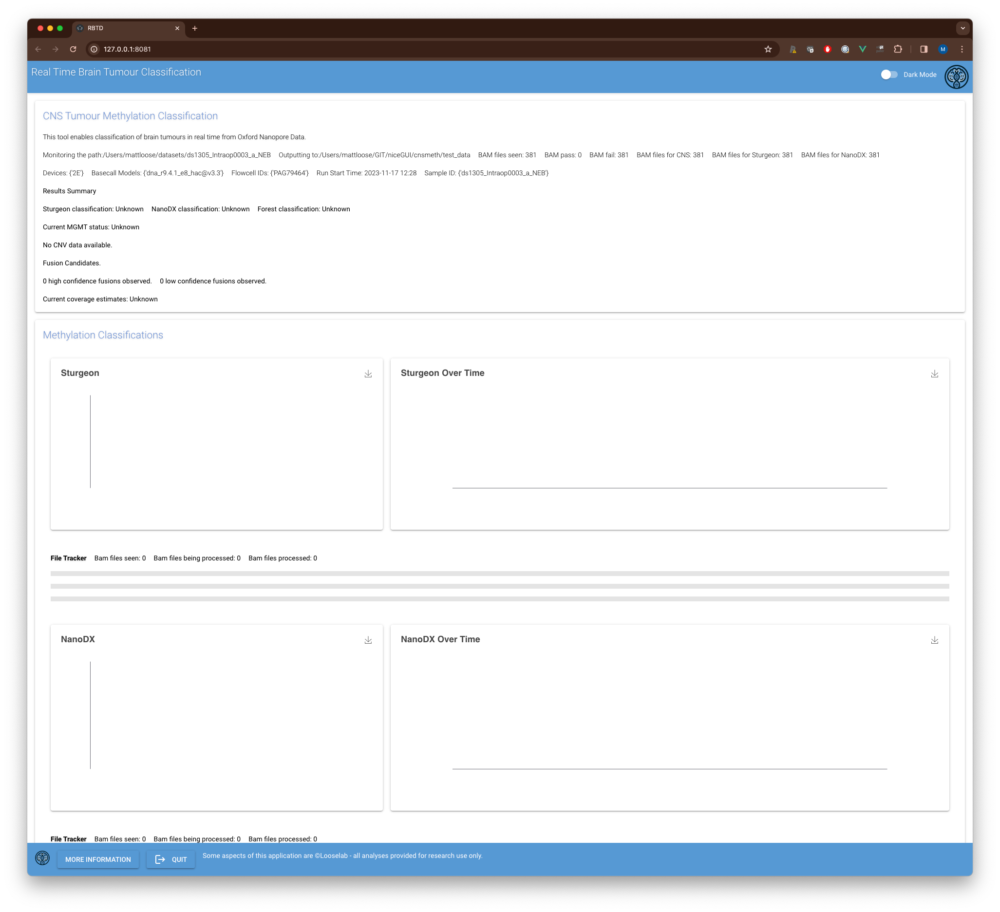
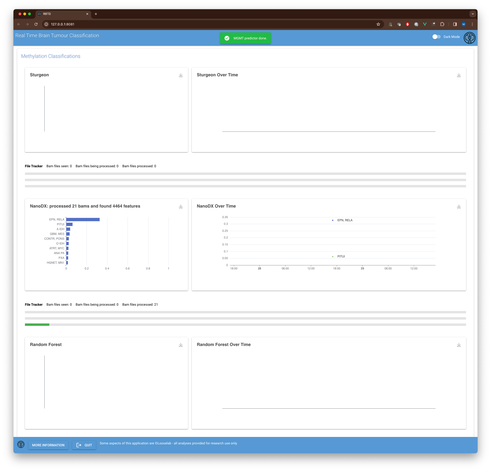

# CNSmeth

[](https://pypi.org/project/methnicegui)
[](https://pypi.org/project/methnicegui)

-----

**Table of Contents**

- [Installation](#installation)
- [Usage](#usage)
- [About](#about)
- [License](#license)


## Installation

Currently we recommend installing 'CNSmeth' using the following conda yml file.

```console
name: cnsmeth
channels:
  - bioconda
  - conda-forge
  - defaults
dependencies:
  - r-base
  - python=3.8
  - pip
  - pip:
    - readfish
    - ont-pyguppy-client-lib
    - git+https://github.com/LooseLab/cnsmeth

```
then to install:

```console
conda env create -f cnsmeth.yml
```

## Usage

```console
cnsmeth --help
python3.8/site-packages/sturgeon/callmapping.py:14: UserWarning: Error loading modbampy, bam functionalities will not work
  warnings.warn('Error loading modbampy, bam functionalities will not work')
Usage: cnsmeth [OPTIONS] WATCHFOLDER OUTPUT

  Entrypoint for when GUI is launched directly. :return: None

Options:
  --port INTEGER             Port for GUI
  --threads INTEGER          Number of threads available.
  --simtime BOOLEAN          If set, will simulate the addition of existing
                             files to the pipeline based on read data.
  --showerrors BOOLEAN       If set, will display all errors in running R.
  --sequencing_summary TEXT  Path to sequencing summary file. If provided,
                             timestamps will be taken from this file.
  --help                     Show this message and exit.
```

You may see a warning about modbampy, this is not an issue and can be ignored at this time.

To run the tool, you will need to provide a watchfolder and an output folder. 

The watchfolder is where the minKNOW will be writing the aligned BAM files for the run you wish to analyse.

The output folder is where results will be written too. This folder must exist and should be empty.

For good performance you should set the highest number of threads you can. Be aware that MinKNOW requires at least 8 cores. So if you are on a 16 core system you should not use more than 8 threads.

If you wish to analyse data after sequencing is complete you can simulate the addition of files to the pipeline by setting the simtime flag OR providing a path to a sequencing summary file. If you provide the simtime flag (--simtime True) then the tool will add one new bam file every 5 seconds. If you provide a sequencing summary file then the tool will use that file to calculate approximately when each BAM file was created by MinKNOW and add the file at that point.

The --showerrors flag will help trouble shoot problems in R.

A typical command line would look like this:

```console
cnsmeth --threads 8  /path/to/watchfolder /path/to/output
```

Upon launch, the GUI will open in your default browser. It should look something like this:



The interface will automatically update as new files are generated by MinKNOW. The first page shows methylation classifications from Rapid-CNS2 and Sturgeon. The current top 10 classifications are shown for each tool. Below these you can see charts showing how these classifications have changed over time.

Sturgeon tends to run very quickly and so results will update more frequently. Rapid-CNS2 accumulates data and runs more periodically.




The upper panel indicates the number of BAM files seen from the run, and the number of files in the queues for RapidCNS2 and Sturgeon respectively.


You can close this window and the tool will continue to run in the background. Quitting the tool using the Quit button will cancel the tool. 

The Copy Number Variation panel shows a real time estimate of copy number assuming the sample is diploid. This is an interactive chart and users can highlight regions of interest. The chart updates after each round of the RAPID CNS2 pipeline and so will take some time to accumulate information.


The coverage panel shows per chromosome coverage and coverage for the targets and off target regions during sequencing. You can also visualise the change in coverage over time.


This panel also provides a filterable table of targets.


The final tab (currently) shows the methylation status across the MGMT promoter region. This plot will take considerable time to generate sufficient coverage to be meaningful.


## About

This tool uses a range of third party tools and applications including:

- [Sturgeon] https://github.com/marcpaga/sturgeon
- [Radid-CNS2] https://link.springer.com/article/10.1007/s00401-022-02415-6
- [Readfish] https://github.com/LooseLab/readfish
- [cnv_from_bam] https://github.com/adoni5/cnv_from_bam
- [methylartist] https://github.com/adamewing/methylartist

We are grateful to the authors of these tools for their work.

We also thank a lot of people who have contributed to these tools including: Graeme Fox, Simon Deacon, Rory Munro, Satrio Wibowo, Thomas Murray, Inswasti Cahyani, Nadine Holmes, Simon Paine, Stuart Smith and many others from outside Nottingham.

We are particularly grateful to Areeba Patel, Felix Sahm and colleagues for their work on Rapid-CNS2.

This list is non-exhaustive and the software is under active development.

Documentation is currently unavailable.

This software is provided "as is", and is for research use only.


## License

`CNSmeth` is distributed under the terms of the [MIT](https://spdx.org/licenses/MIT.html) license.
