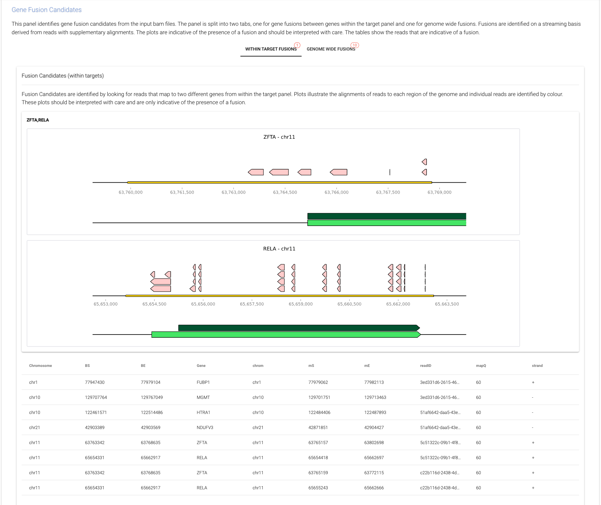

# ROBIN

[](https://pypi.org/project/methnicegui)
[](https://pypi.org/project/methnicegui)

-----

**Table of Contents**

- [Installation](#installation)
- [Usage](#usage)
- [About](#about)
- [License](#license)


## Installation

We recommend installing 'robin' using the following conda yml file included in the repository: [robin.yml](robin.yml)

This will install all the required dependencies including R and Python packages as well as readfish and ont-pyguppy-client-lib.

However, in this version of robin, you will need to install the tool from source. See below for installation details.

The contents of this file are:

```console
name: robin
channels:
  - bioconda
  - conda-forge
  - defaults
dependencies:
  - git-lfs
  - r-base
#  - bioconductor-genomicranges
  - bioconda::snpsift
  - bioconda::snpeff
#  - bioconda::samtools
#  - bioconda::bedtools
#  - bioconda::ont-modkit==0.3.0
  - r-optparse
  - r-data.table
  - conda-forge::r-ranger
  - r-matrixStats
  - r-glmnet
  - ruptures
  - python >=3.9.0,<3.9.19
  - pip
  - pip:
    - readfish
    - ont-pyguppy-client-lib
    - scikit-learn==1.0.2
    - scipy==1.12.0
    - psutil
    #- git+https://github.com/LooseLab/robin
variables:
  _JAVA_OPTIONS: -Xmx8g

```
then to create the environment:

```console
conda env create -f robin.yml
```

To activate the environment:

```console
conda activate robin
```

To install the tool from source follow the instructions below. Please note the git lfs install, pull and submodule update commands are required to download the data files and submodules. Without these you will see errors.

```console
git clone https://github.com/LooseLab/robin/
cd robin
git lfs install
git lfs pull
git submodule update --init --recursive
pip install .
```


## Usage

```console
❯ robin --help
Usage: robin [OPTIONS] [OUTPUT]

  Entrypoint for when GUI is launched directly.

Options:
  -c, --config FILE               Read option defaults from the specified INI
                                  file  [default: config.ini]
  --port INTEGER                  Port for GUI
  --threads INTEGER               Number of threads available.  [required]
  --log-level [DEBUG|INFO|WARNING|ERROR|CRITICAL]
                                  Set the logging level (e.g., DEBUG, INFO,
                                  WARNING).
  --simtime BOOLEAN               If set, will simulate the addition of
                                  existing files to the pipeline based on read
                                  data.
  --showerrors / --noerrors       If set, will display all errors in running
                                  R.
  --sequencing_summary FILE       Path to sequencing summary file. If
                                  provided, timestamps will be taken from this
                                  file.
  -t, --target_panel [rCNS2|AML]  Select analysis gene panel from one of these
                                  options. Default is rCNS2
  -r, --reference FILE            Path to the reference genome and index.
                                  [required]
  --browse                        Browse Historic Data.
  -e, --exclude [sturgeon|forest|nanodx|cnv|fusion|coverage|mgmt]
                                  Exclude analysis types with one or more of
                                  these options.
  -w, --watchfolder DIRECTORY
  --help                          Show this message and exit.
```

To run the tool, you will need to provide a watchfolder and an output folder. If you do not provide a watchfolder, ROBIN will attempt to connect to minKNOW and find runs to analyse. This feature is in development.

The watchfolder is where minKNOW will be writing the aligned BAM files for the run you wish to analyse.

The output folder is where results will be written too. This folder must exist and should be empty.

Optional flags include:

- --port: The port to run the GUI on.
- --threads: The number of threads to use for analysis. This will be the number of threads used by each tool. You should set this with care. On a system with a limited number of cores you should set this to 1. On systems with more CPU cores available you can use more cores. #ToDo: Sensibly manage cores between processes.
- --simtime: This introduces a delay in the adding of bam files to the pipeline and can be used if pointing robin at historic data.
- --showerrors: This will display all errors in R. This is useful for debugging. it should be explicitly set - i.e --showerros True
- --sequencing_summary: This is the path to a sequencing summary file. If provided, timestamps will be taken from this file and data will be loaded based on this file. 
- --browse: This will allow you to browse historic data. This feature is currently incomplete. #ToDo: Complete this feature!
- -e, --exclude: This will allow you to exclude certain analysis types. For example, if you do not wish to run any specific classifier just exclude it. the -e flag can be used multiple times.


A typical command line would look like this:

```console
robin --threads 4  /path/to/watchfolder /path/to/output
```

### IMPORTANT: If running on a p2i you should set threads to 1.

## Launching the GUI

Upon launch, you will be provided with some links from the command line:

```console
> robin  --port 12345 --threads 8 -r ~/references/hg38_simple.fa -w ~/datasets/new_data  /tmp/run2
Watchfolder: /Users/USERNAME/datasets/new_data, Output: /private/tmp/run2
NiceGUI ready to go on http://localhost:12345, http://192.168.4.176:12345, and http://192.168.64.1:12345
Setting up fd18ffff-839c-45bf-9693-0aa8e2df3ce8.
Adding a watchfolder /Users/USERNAME/datasets/new_data
watchfolder setup and added
```

You can navigate to the URL provided in the command line and open the GUI in your browser. If you are running on a remote server, you can use the IP address provided in the command line to access the GUI.
It should look something like this:


From here you can either view live data or browse historic data.

In the top menu bar you can see current CPU and memory usage. You also have a menu allowing you to navigate to other pages.

As of version 0.4.0 there is a dark mode partially available.

The footer provides information on the version of the tool and useful links to resources and tools.

### Important: Clicking on Quit will cancel the analysis. Only do this if you are sure you want to stop the analysis.

If you click on the "live data" option you will see the following page:


The interface will automatically update as new files are generated by MinKNOW.

The top panel provides information summarising general features of the run as well as an update of the current classification status:


The next panel provides a summary of methylation classification results. This will update as the run progresses and will be summarised in the top panel.


The next panel shows information on copy number changes - again this will update during the run, but is also interactive. Individual chromosomes can be inspected in more detail and specific genes highlighted.
Note: the results here are simulated data and the copy number profile is largely meaningless!


The coverage panel shows per chromosome coverage and coverage for the targets and off target regions during sequencing. You can also visualise the change in coverage over time as well as the coverage for specific targets.


The next panel shows the methylation status across the MGMT promoter region. This plot will take considerable time to generate sufficient coverage to be meaningful.


The final panel shows the fusion gene status. This will update as the run progresses and will be summarised in the top panel. High confident fusions occur between two genes in the target panel whereas low confidence fusions occur between a gene in the target panel and a gene elsewhere in the genome. Candidate fusions are identified on the basis of scanning data for reads with supplementary alignments.




## About

This tool uses a range of third party tools and applications including:

- [Sturgeon] https://github.com/marcpaga/sturgeon
- [Radid-CNS2] https://link.springer.com/article/10.1007/s00401-022-02415-6
- [Readfish] https://github.com/LooseLab/readfish
- [cnv_from_bam] https://github.com/adoni5/cnv_from_bam
- [methylartist] https://github.com/adamewing/methylartist

We are grateful to the authors of these tools for their work.

We also thank a lot of people who have contributed to these tools including: Graeme Fox, Simon Deacon, Rory Munro, Satrio Wibowo, Thomas Murray, Inswasti Cahyani, Nadine Holmes, Simon Paine, Stuart Smith and many others from outside Nottingham.

We are particularly grateful to Areeba Patel, Felix Sahm and colleagues for their work on Rapid-CNS2.

This list is non-exhaustive and the software is under active development.

Documentation is currently unavailable.

This software is provided "as is", and is for research use only.


## License

`robin` is distributed under the terms of the [MIT](https://spdx.org/licenses/MIT.html) license.
