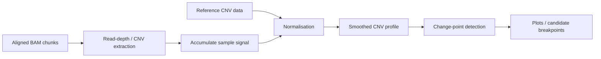

# Copy-number analysis

ROBIN's CNV analysis derives a genome-wide copy-number profile from aligned nanopore reads and updates that profile as additional BAM chunks arrive.

The workflow-facing implementation is in `src/robin/analysis/cnv_analysis.py`.

## Purpose

The CNV pipeline is intended to provide rapid evidence for broad gains and losses and to identify candidate copy-number breakpoints. It complements targeted coverage and structural-event analysis rather than replacing them.

!!! warning
    CNV calls are heuristic. Always review the copy-number profile visually and interpret it in the context of sequencing depth, sample quality, tumour purity, and other molecular/pathological evidence.

## Processing model

The implementation provides:

- sample-versus-reference copy-number analysis;
- dynamic bin-width calculation;
- incremental state across BAM chunks;
- smoothing/normalisation of the copy-number signal;
- change-point/breakpoint detection using `ruptures`;
- sample-level persisted outputs used by the GUI and reporting code.

## Reference data

The analysis uses reference CNV data distributed/resolved through ROBIN resources. The reference dictionary is cached in memory to avoid repeatedly loading the same large object for every sample.

For reproducible interpretation, the input BAM, reference FASTA, and CNV reference resources must correspond to compatible genome coordinates/contig naming.

## Incremental processing

ROBIN receives multiple BAM chunks for the same sample. CNV state is therefore cached/accumulated at sample level. As sequencing progresses, additional reads refine the profile rather than producing unrelated per-BAM CNV plots.

This means a CNV result observed very early in sequencing may change as coverage increases.

## Breakpoint detection

ROBIN applies change-point detection to the copy-number signal to identify candidate transitions between segments.

Candidate breakpoints near chromosome ends and within centromeric satellite regions are filtered because these regions are especially problematic for robust copy-number segmentation. The current implementation also applies a telomere-proximity margin around chromosome tips.

A detected change point is evidence for a transition in the dosage profile; it does not by itself establish the exact structural junction responsible for that change.

## Relationship to structural-event analysis

CNV and fusion/structural analysis answer different questions:

- **CNV** asks whether dosage changes across genomic intervals.
- **Fusion analysis** asks whether individual reads/alignments support candidate rearrangement junctions.

A deletion or amplification can be apparent in the CNV profile without sufficient read-level evidence to identify its precise junction. Conversely, a structural rearrangement can be detected without producing a large copy-number change.

## GUI interpretation

The GUI provides genome-wide and chromosome-level views of accumulated CNV results. When interpreting them, consider:

- whether a change is supported across multiple adjacent bins;
- whether the profile is globally noisy;
- whether the event is close to a centromere/telomere or other difficult region;
- whether target coverage or structural-event evidence supports the same event;
- whether the apparent copy-number magnitude is plausible given tumour purity.

## Troubleshooting

### No CNV result

Check that:

- `cnv` is enabled in the workflow;
- BAMs are aligned to the expected reference;
- the required CNV reference resource is installed/available;
- preprocessing successfully resolved a sample ID;
- job logs do not report an import/resource error.

### Very noisy profile

Common causes include low accumulated coverage, uneven sequencing, incompatible reference/contig naming, or problematic input data. Allow additional BAM chunks to accumulate before interpreting an early noisy profile.

### Breakpoint does not match an exact read junction

This is expected in some cases. CNV segmentation detects changes in dosage and does not guarantee that a rearrangement junction can be resolved from the same data. Review fusion/structural-event outputs where appropriate.