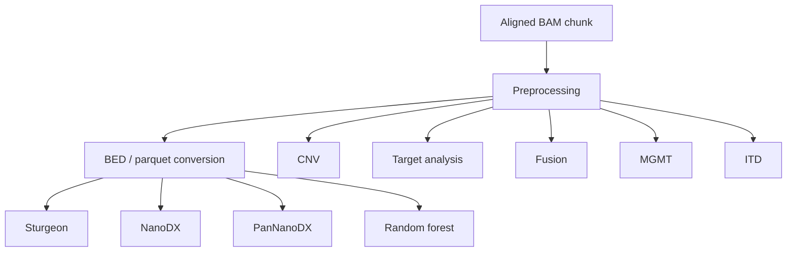

# Analysis pipelines

ROBIN combines complementary analyses from the same stream of aligned Oxford Nanopore BAM files. Some jobs operate directly on BAM alignments; others use methylation data generated by the BED/parquet conversion stage.

This section describes what each major analysis is intended to measure, its important dependencies, and how it fits into the real-time workflow.

!!! warning "Research use only"
    ROBIN is research software. Its outputs, including classifications, copy-number profiles, methylation predictions, structural-event candidates, and variant annotations, require expert interpretation and must not be treated as standalone clinical results.

## Pipeline map



The workflow plan determines which branches are active.

## Input assumptions

ROBIN expects aligned BAMs produced during nanopore sequencing. For the standard real-time workflow:

- use HAC basecalling or better;
- enable CpG-context 5mC/5hmC modified-base calling when methylation analyses are required;
- perform alignment in MinKNOW;
- use read-count-based BAM rollover;
- keep each BAM at or below 50,000 reads for the supported real-time path;
- use a reference assembly/contig naming scheme consistent with the reference supplied to ROBIN.

See [MinKNOW configuration](../getting-started/minknow-configuration.md) for setup details.

## Analysis summary

| Analysis | Primary input | Main purpose |
| --- | --- | --- |
| Preprocessing | BAM | Validate input and extract sample/run metadata |
| BED conversion | BAM modified-base calls | Produce reusable methylation parquet data |
| Sturgeon | Methylation parquet | Neural-network methylation classification |
| NanoDX | Methylation parquet | Neural-network methylation classification |
| PanNanoDX | Methylation parquet | Pan-cancer methylation classification |
| Random forest | Methylation data | Rapid-CNS2 random-forest classification |
| MGMT | BAM / methylation calls | MGMT promoter methylation prediction |
| CNV | BAM alignments | Copy-number profile and candidate breakpoints |
| Target | BAM alignments | Targeted coverage and variant-analysis preparation |
| Fusion | BAM alignments | Candidate rearrangement/fusion detection |
| ITD | BAM alignments | Internal tandem duplication/insertion hotspot detection |

## Methylation classifiers

ROBIN supports multiple methylation classifiers because they provide complementary models and classification frameworks. Their scores should be interpreted in the context of the model being used rather than compared as though all classifiers share the same calibration.

### Sturgeon

Sturgeon consumes the parquet methylation representation produced by BED conversion and uses the installed Sturgeon model/runtime to generate methylation-class predictions. The analysis is incremental: as more methylation observations become available, ROBIN can update the sample classification.

See [Methylation classification](methylation-classification.md).

### NanoDX and PanNanoDX

NanoDX and PanNanoDX use neural-network models supplied with/downloaded for ROBIN. The classification implementation runs model inference in a separate process, helping isolate model execution from the main workflow worker.

See [Methylation classification](methylation-classification.md).

### Random forest

The random-forest analysis uses the Rapid-CNS2 resources and R-based model code. It is generally a heavier/slower classification path and is scheduled separately from latency-sensitive work.

See [Methylation classification](methylation-classification.md).

## MGMT promoter methylation

MGMT analysis focuses on the promoter region at `chr10:129466536-129467536` in the reference coordinate system used by ROBIN. The implementation extracts locus-specific data, evaluates methylation, applies the prediction model, and generates outputs for display/reporting.

See [MGMT](mgmt.md).

## Copy-number analysis

The CNV pipeline derives genome-wide copy-number information from aligned reads, compares the sample signal with reference data, and performs segmentation/breakpoint detection. The implementation supports incremental state and dynamic binning.

CNV results are heuristic and should always be reviewed visually and in the context of sequencing depth and genome-wide behaviour.

See [Copy number](cnv.md).

## Target analysis and variants

Target analysis measures coverage over the active target panel and produces data used elsewhere in ROBIN. The module also contains downstream SNP-analysis support, including Clair3 execution and annotation paths using snpEff/SnpSift and ClinVar resources where configured.

Variant calling has additional software/runtime requirements, notably Docker for the Clair3 path.

See [Target coverage and variants](target-and-variants.md).

## Fusion analysis

Fusion analysis uses alignment structure, particularly supplementary alignments, to identify reads supporting candidate rearrangements involving targeted genes. Preprocessing persists supplementary-read identifiers so downstream fusion processing can work from the complete set associated with each BAM.

Evidence is staged and accumulated across BAM chunks for each sample before sample-level candidate outputs are generated.

See [Structural events](structural-events.md).

## ITD analysis

ITD analysis scans configured hotspot regions for insertion/internal tandem duplication evidence. Hotspots can be resolved from the active panel or explicit configuration. Like fusion analysis, evidence can be staged per BAM and accumulated across the sample.

See [Structural events](structural-events.md).

## Choosing a workflow

A broad CNS workflow may enable target, CNV, fusion, MGMT, and several methylation classifiers. A different target panel or experimental question may justify a smaller workflow.

Use:

```bash
robin list-job-types
```

to inspect the job types available in the installed version, and:

```bash
robin workflow --help
```

for workflow-plan options.

For the orchestration model behind these analyses, see [ROBIN architecture](../architecture/overview.md).