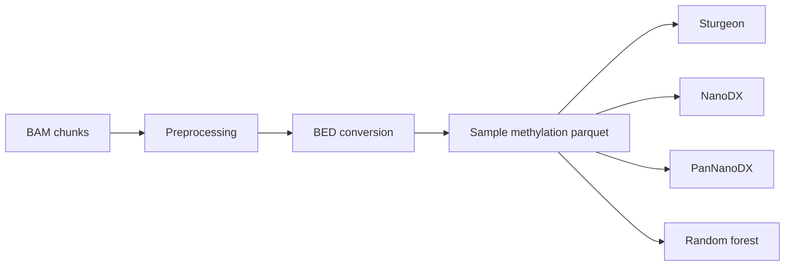

# Methylation classification

ROBIN supports several methylation-based classifiers. They share an upstream modified-base extraction path but use different models and inference implementations.

## Shared methylation input

For the standard classifier workflow, aligned BAM chunks first pass through preprocessing and then `bed_conversion`. The conversion stage uses ROBIN's `matkit` utilities to extract modified-base information and maintain a sample-level parquet representation.



This shared conversion prevents every classifier from independently repeating the same BAM-to-methylation extraction work.

## Modified-base requirements

Methylation classification depends on modified-base tags in the input BAM. For the supported sequencing configuration, enable **5mC/5hmC in CpG contexts** in MinKNOW. All-context modified-base calling is not the expected input mode.

The BAM should already be aligned. ROBIN is not intended to realign the incoming sequencing data as part of this path.

## Sturgeon

The Sturgeon implementation is in `src/robin/analysis/sturgeon_analysis.py`.

It:

1. receives the sample methylation parquet produced by BED conversion;
2. validates and loads the methylation observations;
3. converts the data into the representation required by Sturgeon;
4. performs model inference using the installed Sturgeon/ONNX runtime;
5. writes classification results into the sample output structure for the GUI and reporting layer.

The analysis is designed to be rerun as the accumulated methylation dataset grows, allowing the classification to evolve during sequencing.

### Interpretation

A Sturgeon result is a model score/classification, not an independent pathological diagnosis. Early in a run, limited informative CpGs may make scores unstable. Interpretation should therefore consider the amount of accumulated data and the trajectory of predictions over time.

## NanoDX

NanoDX is implemented in `src/robin/analysis/nanodx_analysis.py` and uses the NanoDX neural-network classifier bundled through ROBIN's submodule/model resources.

The inference step is launched in a separate Python process. This keeps model execution isolated from the main workflow worker and allows inference failures to be handled without taking down the orchestrator.

The analysis returns class labels and prediction values together with metadata such as the number of features used.

## PanNanoDX

PanNanoDX uses the same analysis module and overall processing path as NanoDX but selects the PanNanoDX model/class set.

Do not confuse **PanNanoDX** with a target-panel name. PanNanoDX remains a methylation classifier even where a similarly named historical target panel has been removed from current ROBIN releases.

## Random-forest classifier

The random-forest implementation is in `src/robin/analysis/random_forest_analysis.py`. It integrates the Rapid-CNS2 model resources and R scripts.

The analysis:

- consumes accumulated methylation data;
- prepares the required BED/methylation representation;
- invokes the Rapid-CNS2 random-forest workflow;
- stores scores/votes and metadata for the sample;
- supports repeated analysis as more data arrive.

Because this path is comparatively heavy, the workflow engine can schedule it separately from faster classification and analysis jobs.

## Comparing classifier outputs

The classifiers are complementary, but their raw scores are **not directly interchangeable**. They differ in training data, class definitions, feature sets, preprocessing, and model architecture.

When reviewing a sample:

- consider agreement or disagreement between classifiers;
- inspect how classifications change as sequencing progresses;
- check whether the predicted labels are represented in the model's class set;
- interpret scores alongside CNV, target, MGMT, fusion/ITD, and pathological information where appropriate.

A high score from one classifier should not automatically override contradictory evidence from another analysis.

## Model assets

After installation, download/refresh model assets with:

```bash
robin utils update-models
```

To force replacement of existing downloaded assets:

```bash
robin utils update-models --overwrite
```

The asset-management path performs checksum verification against ROBIN's asset manifest.

## Troubleshooting

### No classifier output

Check that:

- the input BAM contains the expected modified-base tags;
- `bed_conversion` is part of the workflow path;
- the model assets have been downloaded;
- the sample parquet exists and is non-empty;
- the relevant classifier job type is enabled;
- job logs do not show an optional dependency/model import failure.

### Classification remains weak

Low-confidence or unstable early classifications can reflect insufficient informative methylation observations rather than a software failure. Check the amount of accumulated data and whether subsequent BAM chunks improve the signal.

### Classifiers disagree

This is not necessarily an error. The models use different training sets and classification schemes. Review the full evidence rather than trying to transform one model's score into another model's scale.