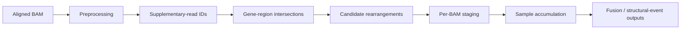

# Structural events: fusions and ITDs

ROBIN contains read-level analyses for structural events that complement the dosage-based CNV pipeline. Two important paths are fusion/rearrangement analysis and ITD/insertion hotspot analysis.

## Fusion analysis

The workflow integration is implemented in `src/robin/analysis/fusion_analysis.py`, with the core processing in `src/robin/analysis/fusion_work.py`.

### What it looks for

Long nanopore reads can contain primary and supplementary alignments when a read spans a rearrangement breakpoint. ROBIN uses this alignment structure to identify candidate events involving genes/regions in the active target panel.

### Supplementary alignments

During preprocessing, ROBIN identifies supplementary-read IDs and persists the complete set under a BAM-specific path in the sample output directory. The fusion handler then loads and validates that set.

This avoids relying on a truncated in-memory list and allows the downstream analysis to revisit all relevant reads from each BAM chunk.

### Staging and accumulation

Fusion evidence is not treated as independent for every BAM. Candidate information is staged per input chunk and accumulated across the sample. This is important because a real event may only gain convincing support after several BAM chunks have arrived.

### Interpretation

A candidate fusion/rearrangement should be evaluated using:

- number of supporting reads;
- mapping quality and uniqueness;
- consistency of breakpoint positions;
- genes/regions involved;
- presence of reciprocal or additional structural evidence;
- corresponding CNV changes where biologically expected.

Supplementary alignment alone does not prove a clinically meaningful fusion.

## ITD / insertion analysis

The workflow integration is in `src/robin/analysis/itd_analysis.py`, with core detection logic in `src/robin/analysis/itd_work.py`.

The analysis is designed for internal tandem duplications and insertion-like events in configured hotspot regions.

### Hotspot configuration

The active scan regions are resolved from the target panel and ITD configuration. Configuration can be supplied through workflow metadata/TOML and is written to the work directory so separate Ray worker processes can use the same settings.

The implementation supports a configurable region mode and thresholds including minimum event length, minimum frequency, and minimum supporting reads.

### Incremental evidence

For each BAM, candidate evidence is staged. ROBIN then force-accumulates the staged candidates at sample level when processing a batch.

The resulting summary includes the number of processed files, detected events, output paths, and genes/hotspots considered.

### Panel dependence

ITD analysis requires an active target panel. If no applicable hotspot overlaps the configured panel, the handler records an empty result rather than scanning arbitrary regions of the genome.

## Relationship to CNV

Structural-event and CNV evidence are related but not equivalent.

A rearrangement can be copy-number neutral, so it may be visible in split/supplementary alignments without a strong CNV signal. Conversely, a broad deletion can be obvious from dosage while its exact junction is not represented by enough informative reads to call structurally.

For important events, review both forms of evidence.

## Input requirements

For fusion/ITD analysis:

- BAMs must already be aligned;
- supplementary alignments should be retained by the alignment process;
- the target panel must use coordinates compatible with the BAM/reference;
- enough reads must span the event to support interpretation.

Alignment settings that remove useful supplementary/split-read information can reduce sensitivity.

## Troubleshooting

### Fusion analysis produces no candidates

This can be a true negative, but also check whether preprocessing found supplementary alignments and whether the relevant genes are present in the active panel.

### ITD analysis reports no scan windows

Check the active `--target-panel` and ITD hotspot configuration. The handler deliberately returns an empty result if no hotspot is applicable.

### Candidate support changes over time

This is expected in real-time operation. Both analyses accumulate evidence as additional BAM chunks arrive. A weak early candidate can gain or lose relative support as the dataset grows.

### Event conflicts with CNV

Do not assume one analysis is necessarily wrong. Structural rearrangements and dosage changes describe different properties of the tumour genome. Inspect the read-level evidence and genomic context.