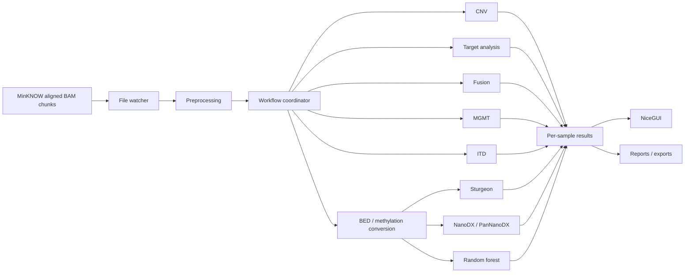

# ROBIN architecture

ROBIN is a real-time analysis system for aligned Oxford Nanopore BAM data. The application combines file watching, workflow orchestration, analysis handlers, persistent per-sample outputs, and a NiceGUI web interface.

This page describes the architecture implemented in `release_candidate2` and is intended for developers and advanced users who need to understand how data moves through ROBIN.

## High-level data flow

The exact jobs that run are selected by the workflow plan and target panel. Not every analysis is required for every run.

## Main components

### Command-line entry point

`src/robin/cli.py` is the principal command-line interface. The `robin workflow` command configures the input directory, output directory, reference, target panel, workflow plan, logging, GUI integration, and execution options.

The CLI should be treated as the supported public entry point. Analysis modules can be imported directly for development and testing, but normal operation should use `robin workflow`.

### Workflow engine

`src/robin/workflow_ray.py` contains the Ray-based workflow engine. It provides:

- specialised workers for different job queues;
- a central coordinator for submission, triggering, deduplication, and statistics;
- per-job batching;
- workflow context objects that carry metadata and results between stages;
- optional GUI update hooks;
- job-specific logging.

Preprocessing is deliberately unbatched because every BAM must first be inspected independently. Most downstream analyses can accumulate multiple BAM chunks for a sample before performing work.

The default batch policy uses small idle timeouts for responsiveness and longer busy timeouts so that files arriving while a worker is occupied can be combined into larger batches. Batch behaviour can be tuned with the `ROBIN_BATCH_TIMEOUT_*` environment variables.

### Workflow context

Each submitted file travels through the workflow with a `WorkflowContext`. The context contains:

- the current file path;
- metadata, including BAM metadata and sample identity;
- results produced by completed jobs;
- processing history;
- errors;
- batch metadata when jobs are grouped.

The sample ID is normally established during preprocessing and is then used to group downstream work and write sample-specific results.

## Preprocessing

`src/robin/analysis/bam_preprocessor.py` is the first analytical stage for BAM input. It validates and inspects each BAM and extracts metadata used by downstream jobs.

Important preprocessing responsibilities include:

- determining sample and run metadata from BAM headers/tags;
- distinguishing pass/fail input where relevant;
- checking modified-base configuration;
- collecting run, device, flow-cell, basecalling, and read statistics;
- identifying supplementary alignments needed by fusion analysis;
- persisting supplementary-read IDs under the sample output directory;
- updating the master CSV state used by ROBIN.

ROBIN is designed around relatively small BAM chunks generated continuously by MinKNOW. The supported workflow expects BAMs of no more than 50,000 reads unless the explicit large-BAM override is enabled.

## Methylation conversion

Several classifiers consume methylation measurements rather than BAM alignments directly. `src/robin/analysis/bed_conversion.py` converts BAM modified-base information into the parquet representation used by those downstream classifiers.

The conversion layer uses ROBIN's `matkit` utilities and can resolve the reference FASTA from the workflow arguments, job metadata, or output directory. A reference-CpG mode is available through `ROBIN_MATKIT_CPG_MODE`.

The resulting methylation data are reused by classifiers rather than independently extracting the same measurements for every model.

## Analysis handlers

Workflow-facing analysis modules expose handler functions that accept a workflow job and update its context/results. Major handlers include:

| Job | Module | Purpose |
| --- | --- | --- |
| `preprocessing` | `bam_preprocessor.py` | BAM validation and metadata extraction |
| `bed_conversion` | `bed_conversion.py` | Modified-base extraction and parquet generation |
| `mgmt` | `mgmt_analysis.py` | MGMT promoter methylation analysis |
| `cnv` | `cnv_analysis.py` | Genome-wide copy-number analysis and breakpoint detection |
| `target` | `target_analysis.py` | Target coverage and downstream variant-analysis preparation |
| `fusion` | `fusion_analysis.py` / `fusion_work.py` | Structural/fusion candidate detection |
| `itd` | `itd_analysis.py` / `itd_work.py` | ITD/insertion hotspot detection |
| `sturgeon` | `sturgeon_analysis.py` | Sturgeon methylation classification |
| `nanodx` | `nanodx_analysis.py` | NanoDX methylation classification |
| `pannanodx` | `nanodx_analysis.py` | PanNanoDX methylation classification |
| `random_forest` | `random_forest_analysis.py` | Rapid-CNS2 random-forest classification |

Additional experimental or specialised handlers may be present in the source tree. Use `robin list-job-types` for the job types exposed by the installed version.

## Per-sample accumulation

A sequencing run produces many BAM chunks. ROBIN therefore treats most analyses as incremental rather than as isolated single-file jobs.

Depending on the analysis, a handler may:

1. stage information extracted from the newly arrived BAM;
2. merge it with previously staged data for the same sample;
3. update cumulative result files;
4. regenerate summaries or plots;
5. notify the GUI that newer results are available.

Fusion and ITD analysis make this staging/accumulation pattern particularly explicit. This design allows evidence distributed across multiple BAM chunks to contribute to the same sample-level result.

## GUI

The NiceGUI application is primarily implemented in `src/robin/gui_launcher.py` with supporting components under `src/robin/gui/`. It reads the evolving per-sample outputs and presents run activity, classifications, copy number, coverage, MGMT, structural events, and other enabled analyses.

The GUI is a presentation and monitoring layer: analytical work remains in the workflow handlers rather than being performed in browser callbacks.

## Output model

`--work-dir` is the root for ROBIN state and results. Downstream analyses create sample-specific files beneath this location. These files serve three purposes:

- persistence across a long-running sequencing session;
- communication between incremental analysis steps;
- input to the GUI and reporting code.

For that reason, deleting or manually editing files in an active ROBIN work directory can invalidate accumulated state. For a clean reanalysis, use a fresh output directory or remove the previous analysis outputs before restarting.

## Design principles

The current architecture reflects several practical requirements of real-time nanopore analysis:

**Incremental processing.** New BAM chunks should refine existing sample results rather than restart an analysis from zero.

**Separation of orchestration and analysis.** Ray/coordinator code schedules jobs; analysis modules implement biological computations.

**Sample-aware state.** Evidence from multiple BAMs is grouped by sample identity.

**Responsive first results.** Initial batches are dispatched quickly, while later chunks can be accumulated for efficiency.

**Fault isolation.** Handlers are imported defensively and job errors are attached to workflow context so that failure of one analysis does not necessarily prevent unrelated analyses from running.

## Where to start when developing

For changes to:

- CLI behaviour: start with `src/robin/cli.py`;
- scheduling, batching, queues, or triggers: `src/robin/workflow_ray.py`;
- BAM metadata: `src/robin/analysis/bam_preprocessor.py`;
- a biological analysis: the corresponding module under `src/robin/analysis/`;
- GUI behaviour: `src/robin/gui_launcher.py` and `src/robin/gui/`;
- reports: `src/robin/reporting/`.

See [Analysis pipelines](../analyses/index.md) for the biological and computational role of each major analysis.