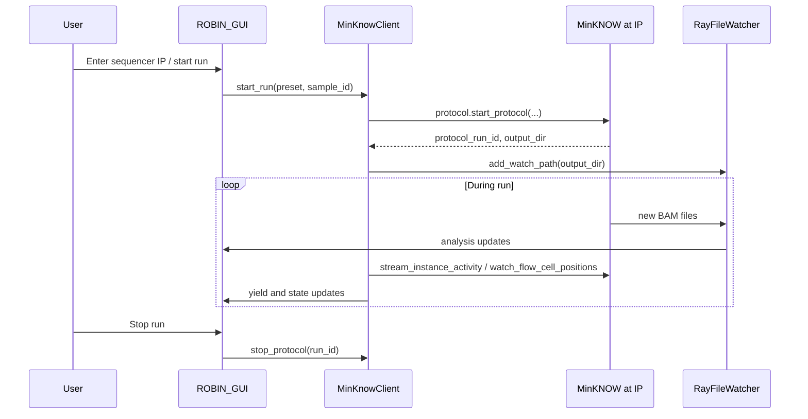

# MinKNOW API integration plan

This document describes how to integrate [MinKNOW API](https://github.com/nanoporetech/minknow_api/) monitoring and run control into ROBIN on branch `feature/minknow-integration`.

**Goal:** connect to a sequencer by IP address, monitor what is running, discover BAM output paths, and (ultimately) start and stop runs with parameters required by ROBIN.

**Related docs:**

- [MinKNOW configuration](../getting-started/minknow-configuration.md) — manual settings ROBIN expects today
- [ROBIN Quickstart](../getting-started/quickstart.md) — current filesystem-based workflow
- Nanopore [AUTH.md](https://github.com/nanoporetech/minknow_api/blob/master/AUTH.md) — authentication options

---

## Background

### What ROBIN does today

ROBIN is **filesystem-driven**:

1. An operator configures MinKNOW manually (basecalling, alignment, BAM rollover, sample ID).
2. MinKNOW writes aligned BAMs to an output directory.
3. `robin workflow` watches that directory (`RayFileWatcher` in `workflow_ray.py`; GUI can add folders via `add_watch_path`).
4. New BAM files trigger the analysis pipeline and GUI updates.

There is **no programmatic link** to the sequencer — ROBIN only sees files once they appear on disk.

### What the MinKNOW API adds

MinKNOW exposes a **gRPC** API (Python client: `pip install minknow_api`). Anything achievable in the MinKNOW UI can be automated, including:

- Listing flow cell positions and their state
- Querying the active protocol run (sample ID, protocol group, run ID)
- Discovering output directories
- Streaming run statistics (yield, read counts)
- Starting and stopping protocol runs

The API does **not** replace BAM processing. It bridges the sequencer and ROBIN's existing file-watching pipeline.

---

## MinKNOW API essentials

### Entry point: Manager service

All clients connect to the **Manager** on a known port on the sequencer host:

| Port | Use |
|------|-----|
| **9502** | Default. Works with developer API tokens and local guest mode. |
| **9501** | Required for **client certificate** authentication (recommended for production). |

```python
from minknow_api.manager import Manager

manager = Manager(host="192.168.1.50", developer_api_token="...")
positions = manager.flow_cell_positions()
```

The Python `minknow_api` package handles TLS (MinKNOW uses a self-signed certificate) and sets `grpc.ssl_target_name_override=localhost` when connecting by IP.

### Service hierarchy

```
Sequencer @ host:9502
└── Manager
    ├── flow_cell_positions()  →  Position 1A, 2B, P2S_000000-A, …
    ├── watch_flow_cell_positions()  (streaming updates)
    ├── protocols  (v2, MinKNOW Core ≥ 6.3 — multi-position start/stop)
    └── per-position Connection (via pos.connect())
        ├── protocol   — start/stop/list runs
        ├── instance   — output directories, activity stream
        ├── device     — flow cell info
        └── statistics — yield, duty time
```

### Key RPCs for ROBIN

| Service | Method | Purpose |
|---------|--------|---------|
| Manager | `flow_cell_positions()` | List positions, state, per-position gRPC ports |
| Manager | `watch_flow_cell_positions()` | Stream position state changes |
| Instance | `get_output_directories()` | Where BAMs will be written |
| Instance | `stream_instance_activity()` | Live position activity summary |
| Protocol | `get_current_protocol_run()` | Active run: sample ID, group, run ID |
| Protocol | `list_protocol_runs()` | Runs since last MinKNOW restart |
| Protocol | `start_protocol()` / `stop_protocol()` | Per-position run control |
| v2 Protocols | `start_protocols()` / `stop_protocols()` | Multi-position control (Core ≥ 6.3) |
| Statistics | `stream_acquisition_output()` | Yield and read counts for dashboards |

Nanopore reference examples (in the `minknow_api` package):

- `minknow_api.examples.list_sequencing_positions`
- `minknow_api.examples.start_protocol`
- `minknow_api.examples.run_after_protocol`
- `minknow_api.examples.extract_run_statistics`

### Version compatibility

`minknow_api` **minor version must match MinKNOW Core minor version** (e.g. Core 6.10.x → `minknow_api==6.10.*`). Check on connect:

```python
manager.core_version  # e.g. "6.10.1"
```

Pin the dependency in `robin.yml` / `pyproject.toml` as an **optional extra** so existing installs are unaffected.

---

## Authentication

Connecting to a sequencer by IP from a remote ROBIN server is a **remote** connection. Local guest/token auth only applies when ROBIN runs on the sequencer itself.

### Recommended: client TLS certificates

1. Generate certificates: `minknow_api.examples.create_client_certificates`
2. Copy the client/CA cert into the sequencer's `conf/rpc-client-certs/`
3. Restart MinKNOW
4. Configure ROBIN with cert paths or environment variables:
   - `MINKNOW_API_CLIENT_CERTIFICATE_CHAIN`
   - `MINKNOW_API_CLIENT_KEY`
5. Connect on port **9501**

See [AUTH.md](https://github.com/nanoporetech/minknow_api/blob/master/AUTH.md).

### Development: developer API token

Generate a token in MinKNOW **Host Settings** (UI). Pass to `Manager(developer_api_token=...)`. Deprecated in favour of client certs but fine for prototyping.

### Troubleshooting auth

| Error | Likely fix |
|-------|------------|
| `Bad metadata key` (local) | Set `MINKNOW_API_USE_LOCAL_TOKEN=1` |
| `Invalid local auth token` (remote) | Set `MINKNOW_API_USE_LOCAL_TOKEN=0`; use API token or client cert |
| `MissingMinknowSSlCertError` | Set `MINKNOW_TRUSTED_CA` to sequencer's `ca.crt` |

### Network

Ensure firewall rules allow:

- Port 9501 or 9502 on the sequencer
- Dynamic per-position secure ports returned by `flow_cell_positions()` (if ROBIN is remote)

---

## ROBIN run requirements (preset)

These are documented for manual MinKNOW setup in [minknow-configuration.md](../getting-started/minknow-configuration.md). The API integration must encode them as a **`RobinRunPreset`** applied when starting a run.

| Requirement | API / CLI equivalent |
|-------------|---------------------|
| HAC basecalling | `--basecalling` + `--basecall-simplex-model` (HAC variant for kit/flow cell) |
| 5mC / 5hmC **CpG contexts only** | `--basecall-modified-models` with CpG models only — **not** all-context |
| Real-time alignment | `--alignment-reference` (path **on the sequencer**) |
| Adaptive sampling (optional) | `--read-until-reference`, `--read-until-bed-file`, `--read-until-filter enrich` |
| BAM output only | `--bam` (omit `--fastq`, `--pod5`) |
| ≤ 50 000 reads per BAM, no time rollover | `--bam-reads-per-file 50000 --bam-batch-duration 0` |
| Sample ID | `--sample-id` (match ROBIN Sample ID Generator if used) |
| Experiment group | `--experiment-group` |
| Run duration | `--experiment-duration` (hours) |
| Sequencing kit | `--kit SQK-...` |

Example command (adapt model names and paths to your instrument):

```bash
python -m minknow_api.examples.start_protocol \
  --host 192.168.1.50 --position P2S_000000-A \
  --sample-id "ROBIN_SAMPLE_ID" \
  --experiment-group "ROBIN_RUN" \
  --kit SQK-LSK114 \
  --experiment-duration 24 \
  --basecalling \
  --basecall-simplex-model "dna_r10.4.1_e8.2_400bps_5khz_modbases_5hmc_5mc_cg_hac_prom@v..." \
  --alignment-reference /data/robin_ref/GRCh38.fna \
  --bed-file /data/robin_ref/rCNS2.bed \
  --bam --bam-reads-per-file 50000 --bam-batch-duration 0
```

Programmatic start uses `minknow_api.tools.protocols.start_protocol()` and helpers (`find_protocol`, `make_protocol_arguments`, `BasecallingArgs`, `OutputArgs`, `ReadUntilArgs`).

### Critical constraint: paths on the sequencer

Alignment reference, panel BED, and output directories must exist on the **sequencer filesystem** (or a mount visible to MinKNOW), not only on the ROBIN server.

Options:

- Run `robin utils sequencing-files` and copy/sync refs to a known path on the instrument
- Use shared storage (NFS) between ROBIN and sequencer
- Document sequencer-side mount points in preset config

Validate model names at start time via `manager.find_basecall_configurations()`.

---

## Proposed code structure

```
src/robin/minknow/
  __init__.py
  auth.py           # Certs/tokens from env or TOML
  client.py         # MinKnowClient — one-shot connect and status
  cli.py            # robin minknow status | watch
  config.py         # MinKnowSettings (host, auth, auto_add_paths)
  models.py         # PositionStatus, SequencerStatus
  monitor.py        # fetch_sequencer_status, table/summary helpers
  parsing.py        # Protobuf → PositionStatus mapping (shared by client + streams)
  stream_monitor.py # MinKnowStreamMonitor — manager + activity streams
  watch.py          # resolve_watch_path, add_watch_path integration, auto-watch
src/robin/gui/components/minknow.py  # Sequencer card on /live_data (full) and /robin (compact)
```

Install the optional extra (match **minor version** to MinKNOW Core):

```bash
pip install 'robin[minknow]'
# Example for Core 6.8.x:
pip install 'minknow_api>=6.8.0,<6.9.0'
```

Environment variables for monitoring and auto-watch:

| Variable | Purpose |
|----------|---------|
| `MINKNOW_HOST` | Sequencer hostname or IP |
| `MINKNOW_ENABLED` | Enable GUI monitor (default: on when host set) |
| `MINKNOW_AUTO_WATCH` | Auto-add new runs to workflow watch list |
| `MINKNOW_API_TOKEN` | Developer API token (remote dev) |
| `MINKNOW_API_CLIENT_CERTIFICATE_CHAIN` / `MINKNOW_API_CLIENT_KEY` | Client TLS auth |
| `MINKNOW_TRUSTED_CA` | Remote sequencer CA certificate |
| `MINKNOW_PRESET` | Default preset TOML path for GUI start form |
| `ROBIN_WORKFLOW_TOML` | Workflow TOML for `reference` / `target_panel` when starting MinKNOW runs |

### CLI commands

```bash
# Phase 1 — monitoring
robin minknow status --host 192.168.1.50 [--api-token TOKEN]
robin minknow watch --host 192.168.1.50                  # one-shot watch active runs
robin minknow watch --host 192.168.1.50 --auto-add-paths # stream + auto-add daemon

# Phase 2 — run control
robin minknow start --host localhost --position P2S_000000-A \
  --sample-id abc123... --preset examples/minknow.example.toml [--dry-run]

robin minknow stop --host localhost --position P2S_000000-A [--run-id RUN_ID] [--wait]
```

Register under a new Click group in `cli.py`, mirroring existing `utils` / `workflow` patterns.

### TOML configuration (proposed extension)

Add optional `[minknow]` section to workflow TOML (`workflow_config.py`):

```toml
[minknow]
host = "192.168.1.50"
# client_cert_chain = "/etc/robin/minknow/client_cert.pem"
# client_key = "/etc/robin/minknow/client_key.pem"
# developer_api_token = "..."   # dev only

[minknow.preset]
kit = "SQK-LSK114"
basecall_simplex_model = "dna_r10.4.1_..._cg_hac_prom@v..."
modified_models = ["..."]       # CpG 5mC/5hmC only
# alignment_reference and bed_file default from workflow `reference` / `target_panel`
read_until_filter = "enrich"
bam_reads_per_file = 50000
bam_batch_duration = 0          # disable time-based rollover
experiment_duration_hours = 24
position = "P2S_000000-A"       # optional default
# simulation_bulk_file = "/path/on/minknow/host/bulk.fast5"  # simulated playback testing
```

### GUI integration (implemented)

**Sequencer (MinKNOW)** card on `/live_data` (full start/stop/watch) and `/robin` (compact status only):

- When `robin workflow --toml …` is used, `[minknow]` / `[minknow.preset]` load automatically — no Preset TOML field in the GUI
- Start form: sample ID only (position, host, duration, etc. from TOML)

- Input: MinKNOW host, Monitor toggle, Auto-watch runs toggle
- Live table via `MinKnowStreamMonitor` (`watch_flow_cell_positions` + per-position `stream_instance_activity`)
- **Watch this run** button per row → `add_watch_path()` for that run's BAM output directory
- **Auto-watch runs** → new protocol runs are added to the workflow watch list automatically
- Manual **Refresh now** uses one-shot `fetch_sequencer_status()` (CLI-style snapshot)

Updates are pushed from background stream threads onto the NiceGUI thread via a queue + short timer (no blocking gRPC on the UI thread).

---

## Implementation phases

### Phase 1a — Client and status CLI

**Deliverables:**

- [x] Add optional dependency: `minknow_api` (version-pinned extra)
- [x] `src/robin/minknow/client.py` — connect, version check, list positions
- [x] Per-position run status — sample ID, output path, flow cell (`_describe_position`)
- [x] `robin minknow status --host IP`
- [x] Unit tests with mocked gRPC (no live sequencer required)
- [x] Auth setup documented below and in `auth.py` env vars

**Acceptance:** `robin minknow status --host <sequencer>` prints positions and active runs.

### Phase 1b — Monitor and GUI panel

**Deliverables:**

- [x] Background stream monitor (`MinKnowStreamMonitor`) using `watch_flow_cell_positions` and `stream_instance_activity`
- [x] GUI card on workflow / live data pages
- [x] Display: position name, state, sample ID, protocol run ID, passed reads, watch path

**Acceptance:** GUI shows live sequencer state without manual refresh.

### Phase 1c — Auto-watch output directories

**Deliverables:**

- [x] On new run detection, resolve BAM output subdirectory for `sample_id` (`watch.resolve_watch_path`)
- [x] Call `add_watch_path()` from `workflow_ray.py` (manual button + auto-watch)
- [x] Guard: do not watch paths overlapping `work_dir` (existing `add_watch_path` validation)
- [x] CLI: `robin minknow watch` and `--auto-add-paths`

**Acceptance:** Starting a run on the sequencer causes ROBIN to pick up BAMs without manual folder add (when auto-watch enabled and workflow is running).

### Phase 2a — Run preset and start CLI

**Deliverables:**

- [x] `RobinRunPreset` in `preset.py` — maps TOML → `protocols.start_protocol` kwargs
- [x] Validate reference/BED paths and basecall models before start
- [x] `robin minknow start` with preset + sample ID + position
- [x] Extend `workflow_config.py` for `[minknow]` keys (`load_minknow_from_workflow_toml`)

**Acceptance:** CLI starts a run matching [minknow-configuration.md](../getting-started/minknow-configuration.md).

### Phase 2b — GUI start run

**Deliverables:**

- [x] Start form: position, duration, sample ID (integrate Sample ID Generator)
- [x] Confirm preset summary before start
- [x] Error handling for auth / path / model failures

**Acceptance:** Operator can start a ROBIN-compliant run from the GUI.

### Phase 3 — Stop run and post-run hooks

**Deliverables:**

- [x] `robin minknow stop --run-id ...` (per-position stop; `--wait` for `wait_for_finished`)
- [x] GUI stop button with confirmation
- [ ] Optional: post-run notification hooks (deferred)

**Acceptance:** Clean stop; ROBIN processes remaining BAMs via existing watcher.

---

## Monitoring flow (reference)

```python
from minknow_api.manager import Manager

def get_sequencer_status(host: str, **auth_kwargs):
    manager = Manager(host=host, **auth_kwargs)
    results = []

    for pos in manager.flow_cell_positions():
        entry = {
            "name": pos.name,
            "state": pos.state,
            "protocol_state": pos.protocol_state,
        }
        if not pos.running:
            results.append(entry)
            continue

        conn = pos.connect()
        run = conn.protocol.get_current_protocol_run()
        if run.HasField("run_info"):
            ui = run.run_info.user_info
            entry["sample_id"] = ui.sample_id.value
            entry["protocol_group"] = ui.protocol_group_id.value
            entry["protocol_run_id"] = run.run_info.run_id

        dirs = conn.instance.get_output_directories()
        entry["output_path"] = dirs.path

        fc = conn.device.get_flow_cell_info()
        entry["flow_cell_id"] = fc.flow_cell_id

        results.append(entry)

    return results
```

Link to ROBIN watch pipeline:

```
MinKNOW run started
  → API returns output_path + sample_id
  → add_watch_path(<output_path>/<sample_id>/...)   # exact subpath TBD per MinKNOW layout
  → RayFileWatcher picks up new BAMs
  → existing analysis unchanged
```

Confirm BAM subdirectory layout on target instruments (P2i, PromethION, GridION) during Phase 1c.

---

## Stopping runs (reference)

**Per-position (all supported Core versions):**

```python
conn.protocol.stop_protocol(protocol_run_id=run_id)
```

**Consolidated v2 (MinKNOW Core ≥ 6.3):**

```python
manager.protocols.stop_protocols(protocol_run_ids=[run_id])
```

Wait for completion:

```python
run_info = conn.protocol.wait_for_finished(run_id=run_id)
```

See `minknow_api.examples.run_after_protocol`.

---

## End-to-end sequence



---

## Decisions to make before coding

| Decision | Options | Notes |
|----------|---------|-------|
| Where ROBIN runs | Same host as MinKNOW vs remote server | Drives auth and path layout |
| Target MinKNOW Core version(s) | Pin `minknow_api` accordingly | Check `manager.core_version` on first connect |
| Auth method | Client certs (prod) vs API token (dev) | Certs scale better across instruments |
| Reference staging | Manual copy, NFS, or install-time sync | Refs must be on sequencer for alignment |
| Read-only first? | Monitor + auto-watch before start/stop | Safer for clinical deployments |
| Optional dependency name | `robin[minknow]` or conda extra | Keep core install unchanged |

---

## Risks and mitigations

| Risk | Mitigation |
|------|------------|
| Wrong `minknow_api` version | Check Core version on connect; fail with clear message |
| Remote auth failure | Document cert setup; surface gRPC errors in CLI/GUI |
| BAM path mismatch | Instrument-specific testing for output dir layout |
| Time-based BAM rollover left on | Preset enforces `bam_batch_duration=0`, `bam_reads_per_file=50000` |
| All-context methylation selected | Preset restricts modified models to CpG configs |
| Accidental run stop in production | Confirmation dialog; read-only mode flag |
| Firewall blocks position ports | Document required ports; test from ROBIN host |

---

## Testing strategy

1. **Unit tests** — mock `Manager` / `Connection`; no live sequencer.
2. **Integration tests** — optional, gated env var `ROBIN_MINKNOW_TEST_HOST`; skip in CI by default.
3. **Simulated playback** — add a simulated MinKNOW position, set `simulation_bulk_file` in `[minknow.preset]` to a bulk FAST5 on the MinKNOW host, then `robin minknow start` and auto-watch BAM output for full-stack testing.
4. **Manual QA** — `list_sequencing_positions` against real instrument; then status CLI; then start on simulated position (`manage_simulated_devices` example) if no hardware available.

---

## First PR checklist (`feature/minknow-integration`)

Phase 1 (monitoring + auto-watch) — implemented:

- [x] `src/robin/minknow/` package (client, streams, watch, config, parsing)
- [x] `robin minknow status --host` and `robin minknow watch`
- [x] Optional dependency `robin[minknow]`
- [x] GUI Sequencer card with stream monitor and watch actions
- [x] Unit tests (client, parsing, stream monitor, watch, CLI)
- [x] This document

Phase 2 (run control) — implemented:

- [x] `robin minknow start` / `robin minknow stop` CLI
- [x] GUI start form with sample ID generator and preset confirmation
- [x] GUI stop button with confirmation dialog
- [x] Unit tests (preset, run, stop, sample ID, start/stop CLI)

Deferred:

- [ ] Post-run notification hooks (Phase 3 optional)

---

## References

- [minknow_api repository](https://github.com/nanoporetech/minknow_api/)
- [minknow_api Python README](https://github.com/nanoporetech/minknow_api/blob/master/python/README.md)
- [Authentication (AUTH.md)](https://github.com/nanoporetech/minknow_api/blob/master/AUTH.md)
- [Breaking changes in 5.0 / 6.0](https://github.com/nanoporetech/minknow_api/blob/master/BREAKING_CHANGES_IN_6.0.md)
- [ROBIN MinKNOW configuration](../getting-started/minknow-configuration.md)
- [ROBIN BAM read limit (README)](https://github.com/LooseLab/ROBIN/blob/main/README.md#bam-read-limit-and-minknow-settings)
